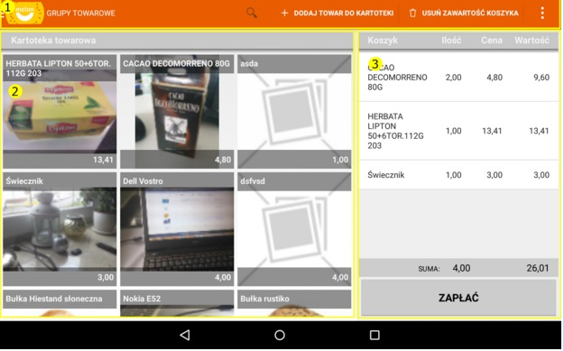



Interfejs programu - tryb sprzedaż
#######################################
.. contents:: Spis treści
    :backlinks: none

Tryb sprzedaż aplikacji MobilePos składa się z 3 głównych bloków 
#. Mentu sprzedaż
#. Lista towarów
#. Koszyk

Menu sprzedaż
********************
Za pomocą menu możemy dostosować widok listy do naszych preferencji tak aby przeglądanie bazy towarowej stało się przyjazne i efektywne w ciągłej sprzedaży. Na liście menu mamy do wyboru filtry grup towarowych oraz sortowania, wyszukiwarkę po słowie oraz opcje programu. Filtry możemy ze sobą łączyć zawężając jednocześnie listę towarów. . 

Grupy towarowe
======================

.. figure:: mobilepos4.jpg

Głównym obszarem z jakiego korzysta sprzedawca podczas filtrowania towarów jest grupa towarowa. Grupy towarowe tworzymy wyłącznie na portalu. (opisane w punkcie … ). Ich pozycje synchronizują się na każdym etapie wymiany informacji pomiędzy tabletem oraz portalem tak a by zawsze były aktualne. Opcję grup towarowych wywołujemy przyciskając ikonkę  dostępną w lewym granicznym polu menu sprzedaży. Grupa o nazwie Kartoteka jest wyborem wszystkich towarów niezależnie od przyporządkowania towaru do grupy. Wybierając z listy dostępnych grup właściwą, lista towarów zawęzi się do wyboru towarów wyłącznie z wybranej grupy.

Wyszukiwarka według wzorca
====================================
.. figure:: mobilepos5.jpg

Przyciskając ikonkę lupki  dostępnej w menu sprzedaży system Android umożliwia wpisywanie ciągu znaków za pomocą wirtualnej klawiatury na ekranie dotykowym. 
Wyszukiwarka służy do przeszukiwania zbiorów towarowych według parametru. 
Filtrowanie odbywa się po dowolnym ciągu znaków towaru co oznacza, że szukając np. frazy “bułka rustinko” można wpisać “rust”. Lista towarów zwęzi się do towarów, które posiadają w swojej bazie taki ciąg znaków. Możliwość przeszukiwania zbiorów jest również możliwy za pomocą kodów EAN towaru. Pasująca fraza zawęża listę dostępnych do wyboru towarów.

.. warning::
   Podłączając skaner kodów kreskowych bezpośrednio do tabletu uzyskujemy możliwość wyszukiwania towarów po kodzie kreskowym.

Metoda sortowania
============================
Listę towarów można również sortować w 2 opcjach: alfabetycznie lub po cenie. Alfabetycznie ustawi wszystkie towary od znaku A do Z. Powtarzając czynność ustawi je odwrotnie. Sortowanie po cenie ustawi towary według towarów najtańszych, powtarzając czynność - od najdroższych.
Sortowanie towarów dostępne jest z poziomu opcji menu bądź naciskając guzik Sortuj dostępny na belce menu sprzedaży.

Dodawanie i edycja towaru do kartoteki
===========================================
System umożliwia dodawanie towarów nie tylko z poziomu portalu ale także z poziomu aplikacji Android. Jednym z założeń funkcjonalnych była sprzedaż towaru nawet kiedy tablet nie ma dostępu do sieci Internet. Oznacza to, że możemy towar dodać a następnie od razu sprzedać. Podczas synchronizacji paragonów towar wcześniej tam nieobecny pojawi się na portalu.
Dodawanie towaru umożliwia przycisk + dodaj towar do kartoteki. Wywoła się formularz dodawania nowego produktu. Należy wypełnić wymagane pola zatwierdzając operację przyciskiem Ok. Czynność dodawania towaru jest identyczna jak w przypadku wersji portalowej. Ciekawym elementem jest dodawanie zdjęcia towaru. W przypadku wersji na tablet można posłużyć się zdjęciem z biblioteki android bądź zrobić zdjęcie aparatem wbudowanym w urządzenie. 

Edycja towaru
========================

Każdy towar może zostać poddany edycji na potrzebę zmiany np. nazwy towaru, ceny, stawki VAT z poziomu tabletu. Czynność tą umożliwia lista towarów, gdzie w celu edycjii towaru użytkownik musi przytrzymać pozycję do czasu pojawienia się w menu zakładki Edytuj towar. Postępowanie w trakcie edycji towaru jest identyczne jak jego dodawanie. Zatwierdzony towar należy zsynchronizować z bazą portalową.

Przeglądanie zawartych transakcji “paragonów”
====================================================
System umożliwia wgląd w archiwum paragonów wykonanych od daty instalacji oprogramowania MobilePos. Z każdą nową transakcją lista uzupełnia się o kolejny nowy paragon. Z listy można odczytać podstawowe informacje takie jak
* numer paragonu
* data utworzenia
* wartość brutto paragonu
* metoda płatności

Naciśnięcie wirtualnego paragonu wyświetla szczegółowe informacje takie jak:
* pozycje towarowe na paragonie
* ilość
* cena 
* wartość
Dostępna opcja synchronizuj wysyła paragony do bazy danych portalu.

.. warning::
    W sytuacjach nadzwyczajnych jak uszkodzenie tabletu, kiedy użytkownik nie zdążył zsynchronizować paragonów, przewidziano możliwość dodawania paragonów ręcznie na portalu. 

Zamykanie programu
==========================

Proces systemowy programu MobilePos raz uruchomiony nie jest zamykany nawet kiedy korzystamy z innej aplikacji dostępnej na tablecie np. przeglądarki internetowej. Jest to jedna z właściwości systemu Android, która pozwala sprzedawcy w każdej chwili kiedy dochodzi do sprzedaży przełączyć się na właściwe okno programu i dokonać transakcji. Umożliwia to przycisk funkcyjny tabletu oznaczony na zdjęciu. 
Całkowite zamkniecie programu następuje z pozycji menu opcji Zamknij. 

Sprzedaż z wykorzystaniem listy towarów i koszyka
*********************************************************
Lista asortymentu towarowego prezentowana jest na tablecie w dwóch formch
* kafelki ze zdjęciem
* lista pozioma jako tekst

Możliwość definiowania widoku dostępny jest w ustawieniach ekranu startowego.
Głównym zadaniem listy towarów jest wyszukanie towaru a następnie wrzucenie go do koszyka znajdującego się po prawej stronie interfejsu programu w trybie sprzedaż. W celu dodania towaru do koszyka należy pozycję towarową wybrać przez przyciśnięcie, gdzie przeniesie się ona do wirtualnego koszyka. Naciśnięcie innego towaru dodaję kolejną pozycję do koszyka. Naciśnięcie tego samego towaru zwiększa jego ilość w koszyku o jeden. 
Funkcja wyboru kilku cen wywoływana jest w momencie dodawania towaru do koszyka, kiedy towar ma przypisanych więcej niż jedna cena. System zapyta się sprzedawcy, którą cenę wybrać. Klient może rozmyślić się z wyboru pojedynczego produktu lub całej transakcji. 

Usuwanie towaru z koszyka
==============================
Usuwanie pojedynczych pozycji jest możliwe przez przytrzymanie nazwy towaru w koszyku, wybór towarów a następnie przyciśnięcie przycisku “Usuń z koszyka”. “Usuń zawartość koszyka” usuwa cały wybrany towar.

Zatwierdzeniem transakcji jest przycisk ZAPŁAĆ.

Sprzedaż towaru na wagę
==============================
Cena towaru przeliczana jest według jednostki ilościowej bądź wagowej. Cena towaru podawana jest zawsze za jeden kilogram. Jeżeli towar został zadeklarowany jako towar sprzedawany na wagę w takcie dodawania towarów do koszyka ale przed jej zakończeniem należy wybrać i przytrzymać towar w koszyku celem zmiany jego wagi. System wyświetli dodatkową opcję umożliwiającą zmianę jednostki wagi towaru. Funckja ta pozwala wpisać bieżącą wagę towaru gdzie system przeliczy odpowiednio wartość według wzoru ilość x waga

Zmiana ceny
===================
Możliwość zmiany ceny towaru, którą przyjmujemy jako stałą definiujemy na portalu bądź w trakcie edycji towaru na tablecie. Istnieją jednak sytuacje, w których sprzedawca chciałby sprzedawać towar w cenie zdefiniowanej na portalu ale jednorazowo sprzedać towar w innej cenie np. uznając towar w pojedynczej sztuce jako wyprzedażowy. Do uniknięcia za każdym razem sytuacji, w której trzeba edytować towar została wprowadzona funkcja zmiany ceny przed jej sprzedażą. Funkcja ta jest dostępna naciskająć i przytrzymując pozycję towarową w koszyku. W czasie  2 sekund pojawi się w menu dodatkowa funkcja zmień cenę. Naciśnięcie przycisku wywoła formularz zmiany ceny bądź wyboru ceny zdefiniowanej na stałe.

Realizacja transakcji
*******************************
Realizacją płatności jest zapis wirtualnego paragonu na tablecie do bazy oraz wydruk paragonu w formie papierowej na drukarce fiskalnej. W tym celu należy zatwierdzić koszyk towarów naciskając przycisk Zapłać znajdujący się pod listą towarów w koszyku. 

Trzy formy płatności :

#. Gotówka - najczęstsza forma płatności. Po dokonaniu płatności kartą za zapis na paragonie fiskalnym oznaczony jest jako “gotówka”
#. Karta - Transakcja bezgotówkowa, po dokonaniu płatności kartą za zapis na paragonie fiskalnym oznaczony jest jako “karta”.
#. Smoopay - system płatności bez gotówkowych, autoryzowany za pomocą aplikacji na telefon komórkowy jako pośrednik między klientem a sprzedawcą. Płatności Smoopay obecnie są w fazie rozwojowej.

.. warning::
   Podgląd zawartych transakcji można podejrzeć wybierając z menu opcji w trybie sprzedaż zakładkę Paragony.
   Potwierdzeniem zawarcia transakcji jest krótka informacja “Zapis paragonu do bazy”.
