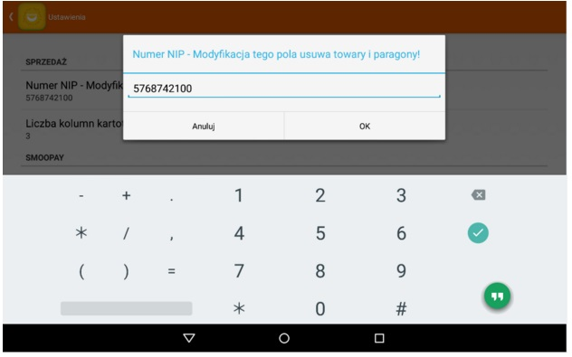
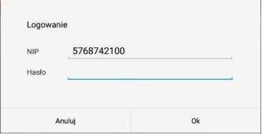



Tablet - konfiguracja aplikacji
######################################
.. contents:: Spis treści
    :backlinks: none

Pierwszym ekranem startowym jaki ukaże się naszym oczom podczas startu aplikacji jest wywołanie wewnętrznej przeglądarki internetowej z adresem http://melonpos.com/. Strona zawiera wszelkie informacje na temat opisu programu MobilePos a także zachęca użytkowników programu w wersji demo do zakupu licenji oprogramowania. Główne menu programu umiejscowione w górnej częsci obszaru roboczego zawiera wywołanie konfiguracji programu oraz przełącznie w tryb sprzedaży. Wyszukiwania (ikona lupki) w oknie startowym nie jest wykorzystywane.

Przypisanie tabletu do  sklepu
************************************
Wybierając zakładkę Ustawienia (kryjący się pod przyciskiem graficznym trzech kropek ułożonych pionowo) uzyskujemy dostęp do podstawowych danych konfiguracyjnych. 
Wymaganym krokiem do uzyskania dostępu jest przypisywanie tabletu do sklepu. Należy odnaleźć sekcję Sprzedaż oraz wpisać numer NIP firmy ustanowiony wcześniej w konfiguracji portalu.

Logując się do trybu sprzedaży aplikacja zarząda autoryzacji użytkownika. W tym celu program wykorzystuje hasło zdefiniowane na portalu w zakładce Dane Firmy sekcja Dane do autoryzacji na tabletach zawiera hasło, które zdefiniować należy zdefiniować i podać podczas logowania

Udane logowanie wpuści użytkownika do trybu sprzedaży. Aplikacja jest obecnie gotowa do pierwszej synchronizacji z portalem. W tym celu należy kliknąć przycisk “Synchronizuj kartotekę”. W przeciągu paru sekund Lista towarów wypełni się pozycjami zdefiniowanymi na portalu. 

Ten moment jest szczególny, gdyż po raz pierwszy tablet zostanie dodany do bazy danych oraz będzie widniał jako zarejestrowany. W tym momencie należy uzupełnić informacje na portalu celem przenależności tabletu do sklepu.

.. warning::
   Domyślnie do systemu można rejestrować 3 tablety. Próba rejestracji większej ilości skutkuje pojawieniem się błędu zabezpieczeń. W celu zwiększenia maksymalnej ilości zarejestrowanych tabletów należy skontaktować sie z działem obsługi klienta.
 
W celu weryfikacji rejstracji tabletu należy skontrolować zakładkę Tablety na portalu. Tablet zarejestrowanny pojawi sie jako nowa pozycja listy dostępnych talbetów w systemie. Tablet można usunąć korzystając z przycisku “usuń” przypisanego do pozycji tabletu. Usunięcie tabletu zwalnia pozycję listy, na którą bedzie można rejestrować ten sam bądź kolejny tablet.
Zarejestrowanemu tabletowi należy uzupełnić dane przechodząc do ustaiweń tabletu - przycisk “edytuj” wypełniając kolejno poszczególne pozycje.
 * Nazwa - w celu prostej identyfikacji tabletu należy podać jego nazwę. Nazwa tabletu będzie przewijać się w innych zakładkach portalu.
 * Powiązanie tabletu ze sklepem - powiązanie tabletu ze sklepem zdefiniowanym wcześniej w zakładce Sklepy. Powiązanie ma znaczenie w zestawieniach raportów obrotu towarem.
 * Konfiguracja Smoopay - umożłiwinie płatności typu smoopay. Należy skontaktować się z działe wsparcia klienta. Sekcja ta nie jest wymagana do wypełnienia. 

Zakładka "Ustawienia" - sekcja Ogólne
********************************************
Dwie pierwsze informacje zawierają pozycję informacyjne bez możliwości modyfikacji
* **Strona główna** - na którą wbudowana przeglądarka loguje się podczas ekranu startowego
* **Serwer komunikacyjny** - baza danych z którą łączy się tablet
Puntkt “Auto synchronizacja paragonów” umożliwia zachowywanie paragonu na portalu po każdej sprzedaży towaru. 
 
Zakładka "Ustawienia" - sekcja Sprzedaż
**********************************************
**NIP Firmy** - numer NIP firmy

.. warning::
   Zmiana numeru NIP kasuje wszystkie dane, zarówno towary jak i paragony dostępne w bazie tabletu.

**Liczba kolumn kartoteki towarowej** - sposób przedstawienia ilości kolumn wyświetlana na liście towarów. Ustawienie to ma znaczenie w przypadku tabletów z wysoką rozdzielczością. Tablety te mogą śmiało pomieścić maksymalną wartość 4 kolumn. Minimalna to 0. W przypadku wybrania 0 lista towarów prezentuje się bez zdjęć w pozycji hoyzontalnej. W trybie tym dostępne są dodatkowe kolumny stan - ilośćtowaru na stanie oraz opis - krótka notatka towaru.

Zakładka "Ustawienia" - sekcja Smoopay
********************************************

Zakładka umożliwia metodę płatności typu smoopay. Pola zostaną automatycznie wypełnione w momencie kiedy zostały zdefiniowane na portalu. 

Zakładka "Ustawienia" - sekcja Urządzenia Bluetooth
***********************************************************

.. warning::
   Pozycje staną się dostępne w po sparowaniu urządzenia drukującego paragony. 

MAC adres - numer karty sieciowej drukarki fiskalnej

Zakładka "Ustawienia" - sekcja Urządzenie Bluetooth, podsekcja Skaner podłączony do drukarki
*************************************************************************************************************
Zaznaczenie opcji jako dostępna uaktywnia nasłuch kodów kreskowych pochodzących ze skanera kodów kreskowych podłączonego do drukarki fiskalnej za pomocą połączenia bezprzewodowego bluetooth. 

**Port skanera** - najeży wybrać właściwy AUX1/ AUX2

**Częstotliwość odświerzania** - szybkość z jaką po zeskanowaniu kodu kreskowgo zostanie zarejestrowana w systemie. Domyslna wartość 1000ms jest optymalna. W przypadku zmiany wartości na graniczne możne dojść do niestablinego działania programu.
**Wersja** - numet wersji zainstalowanego programu. Numer ten przydaje się w momencie kontaktu z pomocą techniczną

Parowanie drukarki fiskalnej
***********************************

System obsługuje drukarki fiskalne marki Novitus przez połącznie bezprzewdowe Bluetooth.
Zestaw urządzeń Novitus powienin zawierać drukarkę fiskalną z wbudowanym bądź dołączanym modułem bluetooth.
W przypadku modułu zewnętrznego należy skontaktować się z przedtstawicielem technicznym Novitus w celu pocy technicznej. Drukarka standardowo nie zapewnia zasilania przez port AUX modułu bluetooth. W celu uaktywnienia zasilania należy przestawić odpowiednie zworki w urządzeniu. 

Moduł bluetooth zawiera naklejkę z informacją nazwy modułu jakim przedstawia się w trakcie wyszukiwania urządzeń np. MKR-BT oraz numer seryjny. Ostatnie 4 cyfry numeru seryjnego to pin, który należy podać w trakcie parowania urzadznia bluetooth. 

Moduł bluetooth sygnalizuje pulsującym światłem swoją aktwność. Jeżeli dioda się nie pali należy raz przycisnąć guzik aktywujący wyszukiwanie.

Aby połączyć się z urządzeniem Bluetooth, musisz najpierw włączyć Bluetooth w swoim tablecie. Przy pierwszym użyciu nowego urządzenia Bluetooth musisz je powiązać („sparować”) ze swoim urządzeniem, by oba mogły się ze sobą bezpiecznie komunikować. Później połączenie jest nawiązywane automatycznie.

.. note::
   jeśli z tabletu korzysta wielu użytkowników, każdy z nich może zmienić globalne ustawienia Bluetootha.

Włączanie i wyłączanie Bluetootha
********************************************
#. Otwórz na urządzeniu menu Ustawienia .
#. W sekcji „Sieci zwykłe i bezprzewodowe” kliknij Bluetooth.
#. Kliknij przełącznik, by włączyć lub wyłączyć Bluetooth.
#. Ikona Bluetooth  u góry ekranu wskazuje, że ta funkcja działa.
#. Widoczność Bluetooth

Urządzenie z Androidem 5.0 lub nowszym będzie widoczne dla urządzeń w pobliżu, gdy otworzysz ustawienia Bluetooth. Jeśli masz urządzenie z Androidem 4.4 lub starszym, to aby stało się widoczne, konieczne może być kliknięcie Menu Menu > Czas widoczności i wybranie, jak długo urządzenie ma być widoczne dla innych urządzeń.

Parowanie tabletu z urządzeniem Bluetooth
*************************************************
Przed połączeniem tabletu z urządzeniem Bluetooth musisz je sparować. Pozostaną one w tym stanie, dopóki nie anulujesz sparowania.

Parowanie z urządzeniem Bluetooth drukarki fiskalnej
***************************************************************
#. Otwórz na tablecie menu Ustawienia .
#. W sekcji „Sieci zwykłe i bezprzewodowe” kliknij Bluetooth.
#. Upewnij się, że Bluetooth jest włączony, a urządzenie – ustawione jako widoczne.
#. Urządzenie wyszuka wszystkie dostępne urządzenia Bluetooth w zasięgu i wyświetli je w sekcji „Dostępne urządzenia”.
Android 4.4 lub starszy: jeśli urządzenie mobilne zakończy wyszukiwanie, zanim urządzenie Bluetooth będzie gotowe, kliknij Szukaj urządzeń u dołu ekranu.
Android 5.0 lub nowszy: jeśli urządzenia Bluetooth nie widać na liście, kliknij kolejno ikonę Menu  iOdśwież.
#. Kliknij nazwę urządzenia Bluetooth np. MKR-BT, z którym chcesz sparować urządzenie mobilne.
#. Postępuj zgodnie z instrukcjami, by dokończyć parowanie. Jeśli będzie trzeba wpisać hasło, podaj PIN 4 ostatnie cyfry numeru seryjnego dostępne na naklejce.Gdy parowanie się uda, urządzenia połączą się ze sobą.

Apliakcja MobilePos musi otrzymać informację jakie urządzenie ma być wykorzystywane jako połączenie bluetooth z drukarką fiskalną. W tym celu należy z menu Ustawień w trybie sprzedaży wybrać zakładkę “Bluetooth” po czym wyświetli się lista dostępnych sparowanych z tabletem urządzeń. Należy zaznaczyć te z którego chcemy korzystać w aplikacji MobilePos. Można wykonać test wydruku potiwerdzający prawidłową konfigurację urządzeń. W tym celu należy ponownie wejśc w zakładkę “Bluetooth” i wybrać opcje “wydruk testowy”. Z drukarki powinien wydrukować się paragon testowy (niefiskalny). Opcja “Wybierz inne” umożliwia przypisanie do programu inne urządzenie bluetooth. 

Podłączenie skanera kodów kreskowych bezpośrednio do drukarki fiskalnej
**********************************************************************************
Skaner kodów kreskowych podłączony bezpośrednio do drukarki fiskalnej może współdzielić  połączenie bluetooth razem z drukarką fiskalną. Skaner należy podłączyć do odpowiedniego portu AUX drukarki i zapamiętać wybór. W początkowych ustawieniach aplikacji MobilePos opisano metodę aktywacji skanera w programie.

Podłączenie skanera kodów kreskowych bezpośrednio do drukarki tabletu
*********************************************************************************
Użytkownik może podłączyć skaner kodów kreskowych bezpośrednio do portu USB tabletu. Aktywacja skanera potwierdza sygnał dźwiękowy skanera. W celu przetestowania prawidłowej pracy skanera należy zeskanować kod kreskowy towaru w dowolnej aplikacji tabletu umożliwijącej wpisywanie tekstu. Jeżeli pojawi się zeskanowny kod kreskowy oznacza to, że skaner działa poprawnie.
Funkcjonalność tą można wykorzystać w aplikacji MobilePos w celu szybkiego dodawania towaru do koszyka. W trybie sprzedaży skanując kod aplikacja przeszuka bazę towarową kodów EAN. Jeżeli zeskanowany kod jest zgodny z tym w bazie danych to towar automatycznie doda się do koszyka. W przypadku kiedy towar nie zostanie znaleziony w bazie to aplikacja samoczynnie wywoła formatkę dodawania nowego towaru. Jeżeli kod będzie pasował do kilku pozycji towarowych to lista towarów wypełni się tymi towarami. 

.. warning::
   Nowe skanery kodów kreskowych powinny zostać skonfgurowane tak aby na końcu kodu zawierał się znak <ENTERA>.

System android, do którego podłączono zewnętrzną klawiaturę w trakcie edycji tekstu nie wysunie wirtualnej klawiatury. Chcąc wpisywać tekst ręcznie należy uaktywnić wirtualną klawiaturę. W tym celu należy wybrać z opcji sprzedaży zakładkę Klawiatura i wybrać klawiaturę wirtualna “klawiatura polski”

Synchronizacja danych z portalem
******************************************
System MobilePos zapewnia obustronną synchronizację danych między portalem a tabletem. Dane jakie są wymieniane:
#. numery urządzeń
#. tokeny autoryzacji
#. grupy towarowe
#. towary
#. paragony
W celu przeprowadzenia synchronizacji należy w trybie sprzedaży wejść w ustawienia aplikacji i wybrać opcję Synchronizuj. Po paru sekundach (w zależności od prędkości łącza intenretowego) dane pomiędzy portalem i tabletem powinny zostać wymienione i zaktualizowane.

